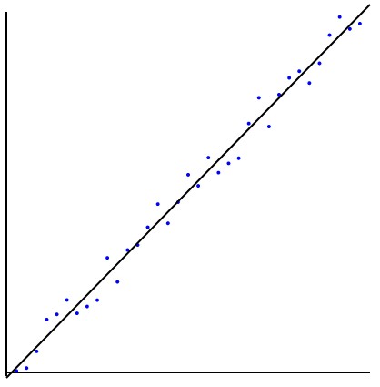

# NEON-powered SIMD Linear Regression
ARM64 assembly implementation of linear regression using the NEON SIMD features for vectorization.
Mainly as exercise in asm programming, for experimentation and learning. 
The vectorization speedup is measurable, on my M2 Macbook Air the the SIMD implementation is over 10x faster than the naive C implementation.

## Useful Resources
* Howard Oakley's ARM Assembly articles, in particular "Lanes and loads in NEON" https://eclecticlight.co/2021/08/23/code-in-arm-assembly-lanes-and-loads-in-neon/
* Raymond Chen's ARM64's series https://devblogs.microsoft.com/oldnewthing/20220726-00/?p=106898

## Feedback
Feedback
Bugs/Suggestions/Comments/Feedback to:
Email: LG@THLG.NL
